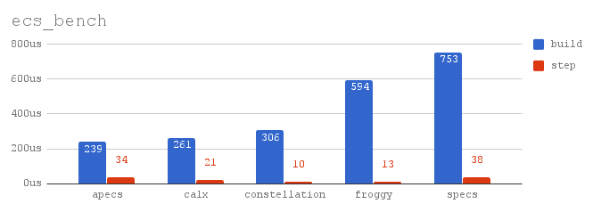

# apecs [](https://travis-ci.org/jonascarpay/apecs) [](https://gitter.im/apecs_hs/Lobby)
apecs is an _Entity Component System_ (ECS) framework inspired by [specs](https://github.com/slide-rs/specs) and [Entitas](https://github.com/sschmid/Entitas-CSharp).
ECS presents a data-driven approach to game development, that elegantly tackles many of the unique issues of game programming.
apecs aims to be
* **Fast** - apecs is designed for high-performance applications. Its performance is competitive with Rust ECS libraries (see benchmark results below).
* **Simple** - Game logic is expressed using a small number of combinators, and minimal boilerplate.
* **Safe** - The `cmap`/`cfold`-DSL completely hides the dangers of the low-level API.
* **Extensible** - apecs can be used with anything that implements the low-level API. See [apecs-physics](apecs-physics/) or [apecs-stm](apecs-stm/) for examples.



#### Links
- [paper (prepublication)](apecs/prepub.pdf) (see [#19](https://github.com/jonascarpay/apecs/issues/19))
- [tutorial](examples/Shmup.md) and other [examples](examples/)
- [apecs-physics](apecs-physics/)
- [documentation](https://hackage.haskell.org/package/apecs/docs/Apecs.html)

#### Status
| Package | Hackage | Stack LTS | Stack Nightly |
|---|---|---|---|
| [apecs](apecs/) | [](https://hackage.haskell.org/package/apecs) | [](https://www.stackage.org/package/apecs) | [](https://www.stackage.org/package/apecs)
| [apecs-physics](apecs-physics/) |  [](https://hackage.haskell.org/package/apecs-physics) | [](https://www.stackage.org/package/apecs-physics) | [](https://www.stackage.org/package/apecs-physics) |
| [apecs-gloss](apecs-gloss/) | [](https://hackage.haskell.org/package/apecs-gloss) | [](https://www.stackage.org/package/apecs-gloss) | [](https://www.stackage.org/package/apecs-gloss) |
| [apecs-stm](apecs-stm/) | [](https://hackage.haskell.org/package/apecs-stm) | - | - |
| [examples](examples/) | - | - | - |

#### Example
```haskell
{-# LANGUAGE DataKinds, FlexibleInstances, ScopedTypeVariables, TypeFamilies, MultiParamTypeClasses, TemplateHaskell #-}

import Apecs
import Control.Monad
import Apecs.Util
import Linear (V2 (..))

newtype Position = Position (V2 Double) deriving Show
newtype Velocity = Velocity (V2 Double) deriving Show
data Flying = Flying

makeWorldAndComponents "World" [''Position, ''Velocity, ''Flying]

game :: System World ()
game = do
  newEntity (Position 0, Velocity 1)
  newEntity (Position 2, Velocity 1)
  newEntity (Position 1, Velocity 2, Flying)

  -- 1. Add velocity to position
  -- 2. Apply gravity to non-flying entities
  -- 3. Print a list of entities and their positions
  cmap $ \(Position p, Velocity v) -> Position (v+p)
  cmap $ \(Velocity v, _ :: Not Flying) -> Velocity (v - V2 0 1)
  cmapM_ $ \(Position p, Entity e) -> liftIO . print $ (e, p)

main :: IO ()
main = initWorld >>= runSystem game
```
