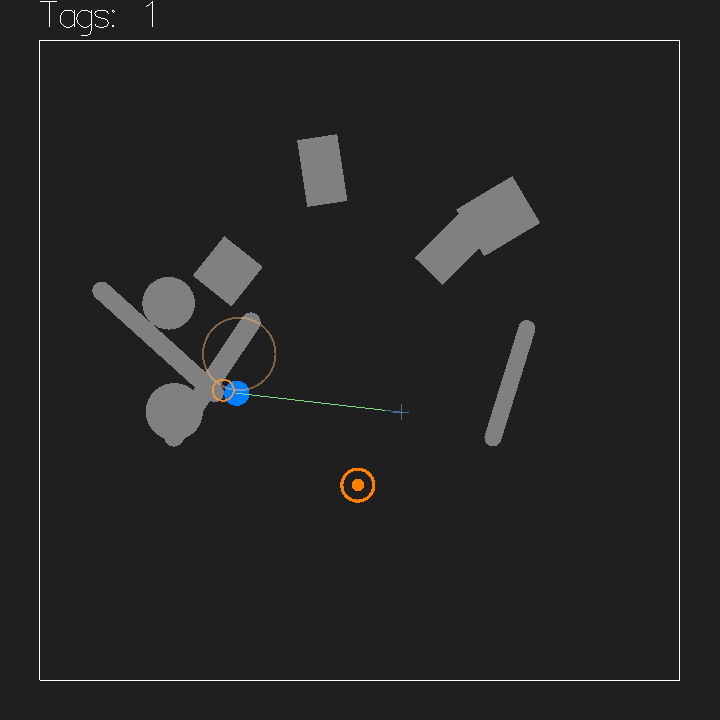
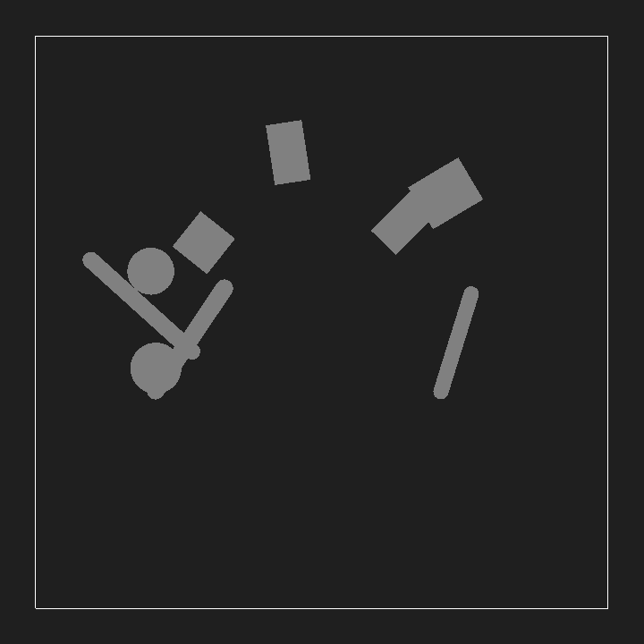
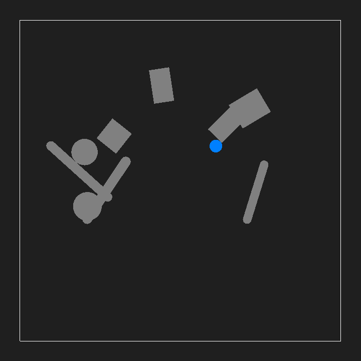
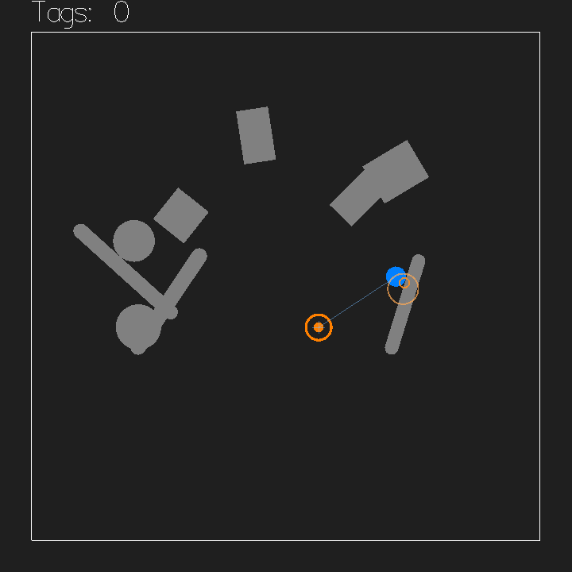

# Tutorial: arena tag

In this tutorial you build a small top-down game with apecs and Box2D:
a puck you drive around a walled arena, trying to zap a totem with a
tag ray before it loses patience and pops up somewhere else. Walls
block both your path and your line of sight, so you have to actually
get there.



You already know apecs — `makeWorld`, components, `cmap`, globals.
You don't need to know anything about Box2D; the point of this
tutorial is to show you how the physics engine appears through the
apecs API you already speak. Along the way you will:

- put a physics world into your apecs world and step it,
- create bodies and shapes as components,
- drive a body with forces and read its transform back,
- teleport a body and query the world for free space,
- cast a tag ray and find out *which entity* it hit,
- react to collision events.

The finished game is [`Main.hs`](Main.hs) next to this file. In this
repo it builds as the `apecs-box2d-tutorial` executable:

```sh
stack build apecs-box2d --flag apecs-box2d:examples
stack run apecs-box2d-tutorial
```

WASD or the arrow keys drive, the mouse aims, left click fires the
tag ray.

If you follow along in your own project instead, you need `apecs`,
`apecs-box2d`, `apecs-gloss`, `gloss`, `Box2D`, `containers`, `linear`
and `random` in your build-depends, and `default-language: GHC2021`
(the snippets use post-qualified imports and type applications).

## 1. A world that steps physics

Start with a world that contains physics and nothing else. Create
`Main.hs`:

```haskell
{-# LANGUAGE TemplateHaskell #-}
{-# LANGUAGE TypeFamilies #-}

module Main (main) where

import Apecs
import Apecs.Gloss
import Control.Monad (forM_, replicateM_, when)
import Graphics.Gloss.Geometry.Angle (radToDeg)

import Apecs.Box2D

-- | Local-space picture, placed by the entity's Box2D body transform.
newtype Look = Look Picture

instance Component Look where
  type Storage Look = Map Look

makeWorld "World" [''Physics, ''Camera, ''Look]
```

`Physics` is the whole trick. It's an uninhabited marker component:
listing it in `makeWorld` gives your world a live Box2D engine world,
and every physics component you meet below — `Body`, `Position`,
`Shape`, `Gravity`, ... — is stored *inside that engine*, not in an
apecs map. When you `get` a `Position` you're asking Box2D, and when
you `set` one you're telling it. There is no mirror copy to keep in
sync.

`Camera` and `Look` are ordinary apecs-gloss and apecs components:
Box2D doesn't render anything, so every visible entity carries a
gloss picture and we place it ourselves.

Now the arena floor plan — a border fence, and the world settings:

```haskell
arenaHalf :: Float
arenaHalf = 10

background :: Color
background = greyN 0.12

-- | Camera, zero gravity, the border and the random inner walls.
makeArena :: SystemT World IO ()
makeArena = do
  set global (Camera 0 32, Gravity vec2Zero)
  makeBorder

-- | One static body fenced in by four segment shapes.
makeBorder :: SystemT World IO ()
makeBorder = do
  let
    h = arenaHalf
    corners = [(-h, -h), (h, -h), (h, h), (-h, h)]
  border <- newEntity (StaticBody, Look (Color white (lineLoop corners)))
  forM_ (zip corners (drop 1 corners <> take 1 corners)) $ \((x1, y1), (x2, y2)) ->
    newEntity_ (Shape border (GeoSegment (Vec2 x1 y1) (Vec2 x2 y2)))
```

Three things to notice, because they set the pattern for everything
else:

**Gravity is a global you must zero.** A fresh Box2D world has
gravity `(0, -10)` — it assumes a side-view game. We're top-down, so
the first thing `makeArena` does is switch it off. (`Vec2` is Box2D's
own single-precision vector type; `vec2Zero` and friends come with
it.)

**Bodies and shapes are separate entities.** `newEntity (StaticBody, ...)`
creates an engine body. It has a transform but no substance yet;
collision geometry hangs off it as `Shape` components, each on its
*own* entity, pointing back at the body entity — the same split
apecs-physics uses. Here one border body carries four `GeoSegment`
shapes. Geometry is given in body-local coordinates.

**Component order in a tuple matters.** Sub-components like
`Position` or `Look`-siblings that talk to the engine only work once
the entity has a `Body`, and setting them on an entity without one is
a silent no-op. In `newEntity (StaticBody, ...)` the body comes
first, so everything after it in the tuple lands on a real engine
body. Keep `Body` first and you'll never chase this bug.

Finish the skeleton with drawing, stepping and `main`:

```haskell
-- | Read each body's transform back from Box2D and place its picture.
drawBodies :: SystemT World IO Picture
drawBodies = foldDraw $ \(Position (Vec2 x y), Angle theta, Look pic) ->
  Translate x y (Rotate (negate (radToDeg theta)) pic)

step :: Float -> SystemT World IO ()
step dT = stepPhysics (min dT (1 / 30))

main :: IO ()
main = do
  w <- initWorld
  runSystem (makeArena >> play disp background 60 drawBodies (\_ -> pure ()) step) w
  where
    disp = InWindow "arena tag" (720, 720) (10, 10)
```

The draw system is where the direction of data flow reverses: each
frame we *read* `Position` and `Angle` back out of the engine and
place each entity's `Look` there. `stepPhysics dT` advances the
simulation; clamping the delta keeps a slow frame from becoming a
huge, tunnel-prone physics step. Nothing moves yet — but run it, and
you should get a dark window with a white square fence.

## 2. Random walls

An empty arena is no fun to run around. Add random static obstacles —
boxes, pillars and capsule bars — with random sizes, positions and
rotations. You'll need two more imports:

```haskell
import System.Random (randomRIO)
import Box2D.MathTypes (vec2Length)
```

```haskell
{- | A static wall of random shape, size, position and rotation.

Placement allows for the wall's reach — the farthest any part sticks
out from the body origin — so nothing covers the player spawn in the
middle or pokes through the border.
-}
makeObstacle :: SystemT World IO ()
makeObstacle = do
  kind <- liftIO (randomRIO (0 :: Int, 2))
  (geo, reach, pic) <- liftIO $ case kind of
    0 -> do
      hw <- randomRIO (0.4, 1.2)
      hh <- randomRIO (0.4, 1.2)
      pure (GeoBox hw hh, sqrt (hw * hw + hh * hh), rectangleSolid (2 * hw) (2 * hh))
    1 -> do
      r <- randomRIO (0.5, 1)
      pure (GeoCircle vec2Zero r, r, circleSolid r)
    _ -> do
      l <- randomRIO (1, 2.5)
      r <- randomRIO (0.25, 0.4)
      pure
        ( GeoCapsule (Vec2 (-l) 0) (Vec2 l 0) r
        , l + r
        , Pictures
            [ Translate (-l) 0 (circleSolid r)
            , Translate l 0 (circleSolid r)
            , rectangleSolid (2 * l) (2 * r)
            ]
        )
  theta <- liftIO (randomRIO (0, pi))
  p <- liftIO (randomBetween (2 + reach) (arenaHalf - 0.5 - reach))
  wall <- newEntity (StaticBody, Position p, Angle theta, Look (Color (greyN 0.5) pic))
  newEntity_ (Shape wall geo)

-- | A random point whose distance from the center is between the bounds.
randomBetween :: Float -> Float -> IO Vec2
randomBetween rMin rMax = do
  x <- randomRIO (-rMax, rMax)
  y <- randomRIO (-rMax, rMax)
  let v = Vec2 x y
  if vec2Length v < rMin || vec2Length v > rMax then
    randomBetween rMin rMax
  else
    pure v
```

and call it from `makeArena`:

```haskell
  makeBorder
  replicateM_ 9 makeObstacle
```

Each obstacle picks one of three `Geometry` constructors and builds
the matching gloss picture by hand — remember, the engine won't draw
for you, so the picture and the geometry agreeing is on you. The
`GeoBox` is axis-aligned *in body space*; giving the body an `Angle`
rotates box and picture together, because `drawBodies` reads the
angle back. Note the placement math works with each wall's *reach*:
`randomBetween` samples the body origin, but what must stay out of
the center disc and inside the border is the farthest point of the
shape, not its origin.

Run it:



Yours will differ — it's random — but you should see the same kind of
rubble.

## 3. A puck you can drive

Time for a player. Two new components: a `Unique` tag for the player
entity, and a global set of currently-held keys. More imports:

```haskell
import Data.Set qualified as Set
import Box2D.MathTypes (vec2Add, vec2Length, vec2Normalize, vec2Scale)
```

```haskell
-- | The player's puck (at most one).
data Player = Player

instance Component Player where
  type Storage Player = Unique Player

-- | The movement keys currently held.
newtype Keys = Keys (Set.Set Key)

instance Semigroup Keys where
  Keys a <> Keys b = Keys (a <> b)

instance Monoid Keys where
  mempty = Keys mempty

instance Component Keys where
  type Storage Keys = Global Keys
```

Add `''Player` and `''Keys` to the `makeWorld` list. Then the puck
itself, plus two tuning constants:

```haskell
playerRadius, thrust :: Float
playerRadius = 0.4
thrust = 30

-- | A dynamic puck at the center; damping stands in for floor friction.
makePlayer :: SystemT World IO ()
makePlayer = do
  player <-
    newEntity
      (DynamicBody, LinearDamping 5, Player, Look (Color azure (circleSolid playerRadius)))
  newEntity_ (Shape player (GeoCircle vec2Zero playerRadius), Elasticity 0.3)
```

This is your first `DynamicBody` — the engine now owns its motion,
and all we get to do is push it. Two physics choices give the puck
its feel. `LinearDamping` bleeds velocity every step: a top-down
world has no floor, so damping plays the role of floor friction, and
`thrust` against damping sets the top speed. `Elasticity` (Box2D's
restitution — set on the *shape* entity, like the material property
it is) makes wall hits bounce a little instead of thudding.

Input is plain gloss event handling into the `Keys` global:

```haskell
handle :: Event -> SystemT World IO ()
handle event = case event of
  EventKey key Down _ _ -> modify global (\(Keys held) -> Keys (Set.insert (unshift key) held))
  EventKey key Up _ _ -> modify global (\(Keys held) -> Keys (Set.delete (unshift key) held))
  _ -> pure ()

{- | Normalize a key's case.

Gloss reports character keys with Shift applied: a 'w' pressed plain
but released with Shift held ('W') would never leave the held set — a
stuck key.
-}
unshift :: Key -> Key
unshift (Char c) = Char (toLower c)
unshift key = key
```

(`toLower` comes from `Data.Char`.)

and driving is one system that turns held keys into a `Force`:

```haskell
-- | Sum the held movement keys into a thrust force on the player.
drivePlayer :: SystemT World IO ()
drivePlayer = do
  Keys held <- get global
  let
    bindings =
      [ ([Char 'w', SpecialKey KeyUp], Vec2 0 1)
      , ([Char 's', SpecialKey KeyDown], Vec2 0 (-1))
      , ([Char 'a', SpecialKey KeyLeft], Vec2 (-1) 0)
      , ([Char 'd', SpecialKey KeyRight], Vec2 1 0)
      ]
    dir = foldl vec2Add vec2Zero [v | (keys, v) <- bindings, any (`Set.member` held) keys]
  when (vec2Length dir > 0) $
    cmap $
      \Player -> Force (vec2Scale thrust (vec2Normalize dir))
```

`Force` is a *write-only* component: setting it doesn't store
anything, it applies a force to the body's center, forces from
multiple sets add up, and the next `stepPhysics` consumes and clears
them. So it must be re-applied every frame while a key is down —
which is exactly what calling `drivePlayer` from `step` does:

```haskell
step :: Float -> SystemT World IO ()
step rawDt = do
  let dT = min rawDt (1 / 30)
  drivePlayer
  stepPhysics dT
```

The clamp gets a name now, because from here on everything
time-based — the physics and the gameplay timers we add next — must
run off the *same* delta, or a stalled frame would age your timers
faster than the simulated world they live in.

Hook it up — call `makePlayer` after `makeArena` in `main`, and pass
`handle` to `play` instead of the do-nothing handler. Run it and
drive around. The engine does the rest: you plow into walls, scrape
along them, bounce off corners. Nowhere in your code is there a
collision check.



## 4. The totem

Now something to chase: a totem that sits still until you tag it —
or until it runs out of patience and relocates on its own. Two more
components (add them to `makeWorld`):

```haskell
-- | The tag totem (at most one).
data Target = Target

instance Component Target where
  type Storage Target = Unique Target

-- | Seconds until the totem relocates on its own.
newtype Patience = Patience Float

instance Semigroup Patience where
  _ <> b = b

instance Monoid Patience where
  mempty = Patience 0

instance Component Patience where
  type Storage Patience = Global Patience
```

```haskell
targetRadius, patienceLimit :: Float
targetRadius = 0.5
patienceLimit = 5

-- | The static totem the player is trying to tag.
makeTarget :: SystemT World IO ()
makeTarget = do
  let look = Color orange (Pictures [circleSolid (targetRadius * 0.4), ThickCircle targetRadius 0.1])
  target <- newEntity (StaticBody, Target, Look look)
  newEntity_ (Shape target (GeoCircle vec2Zero targetRadius))
  relocateTarget

-- | Teleport the totem to a free spot and reset its patience.
relocateTarget :: SystemT World IO ()
relocateTarget = do
  set global (Patience patienceLimit)
  cmapM_ $ \(Target, target) -> do
    p <- freeSpot
    set target (Position p)

-- | A random spot where a totem-sized circle overlaps nothing.
freeSpot :: SystemT World IO WVec
freeSpot = do
  p <- liftIO (randomBetween 2 (arenaHalf - 1))
  occupied <- overlapQuery (GeoCircle p (targetRadius + 0.1)) everything
  if null occupied then pure p else freeSpot
```

Two new moves here. Setting `Position` on an existing body
*teleports* it — the engine updates its transform and carries on;
that's the entire respawn mechanic. And `freeSpot` asks the engine a
question with `overlapQuery`: "which bodies actually overlap this
circle, placed here, in world space?" If the answer is nobody, the
spot is free — no totem inside a wall, none on top of the player.
`everything` is the query filter that matches every shape; `WVec` is
just `Vec2`, documenting that the point is in world coordinates.

Patience is a plain apecs timer, ticked from `step` after the
physics:

```haskell
-- | Relocate the totem when patience runs out.
tickTimers :: Float -> SystemT World IO ()
tickTimers dT = do
  Patience t <- get global
  if t <= dT then relocateTarget else set global (Patience (t - dT))
```

Add `makeTarget` to the setup and `tickTimers dT` at the end of
`step`. Run it: an orange totem hops to a new lawful spot every five
seconds.

## 5. Tag it with a ray

The actual game: aim with the mouse, click, and a ray decides whether
you tagged. Components for the aim point, the score, and a visible
beam flash (into `makeWorld` they go):

```haskell
-- | The mouse cursor, in world coordinates.
newtype Aim = Aim WVec

instance Semigroup Aim where
  _ <> b = b

instance Monoid Aim where
  mempty = Aim vec2Zero

instance Component Aim where
  type Storage Aim = Global Aim

-- | Totems tagged so far.
newtype Score = Score Int

instance Semigroup Score where
  Score a <> Score b = Score (a + b)

instance Monoid Score where
  mempty = Score 0

instance Component Score where
  type Storage Score = Global Score

-- | A tag-ray flash: endpoints, whether it tagged, seconds left.
data Beam = Beam WVec WVec Bool Float

instance Component Beam where
  type Storage Beam = Map Beam
```

Mouse events keep `Aim` fresh; a click fires. Extend `handle` with
these two cases *above* the generic `EventKey` ones, and add the
imports `Linear (V2 (..))` and `Box2D.MathTypes (vec2MulAdd, vec2Sub)`:

```haskell
  EventKey (MouseButton LeftButton) Down _ screenPos -> do
    updateAim screenPos
    fireTag
  EventMotion screenPos -> updateAim screenPos
```

```haskell
updateAim :: (Float, Float) -> SystemT World IO ()
updateAim screenPos = do
  camera <- get global
  let V2 x y = windowToWorld camera screenPos
  set global (Aim (Vec2 x y))
```

(`windowToWorld` is apecs-gloss; it hands back a linear `V2`, which
we convert at the boundary — the wrapper deliberately stays in
Box2D's native `Vec2` and lets you pick your vector library.)

Now the heart of the game:

```haskell
tagRange, beamFade :: Float
tagRange = 40
beamFade = 0.25

{- | Cast a tag ray from the player towards the aim point.

The segment starts inside the player's own shape, which 'segmentQuery'
ignores, so the player never tags itself; the first thing along the
ray decides whether it's a tag.
-}
fireTag :: SystemT World IO ()
fireTag = cmapM_ $ \(Player, Position from) -> do
  Aim at <- get global
  let dir = vec2Sub at from
  when (vec2Length dir > 0.001) $ do
    let far = vec2MulAdd from tagRange (vec2Normalize dir)
    hit <- segmentQuery from far everything
    case hit of
      Nothing -> newEntity_ (Beam from far False beamFade)
      Just rayHit -> do
        tagged <- exists (rayHitBody rayHit) (Proxy @Target)
        newEntity_ (Beam from (rayHitPoint rayHit) tagged beamFade)
        when tagged $ do
          modify global (\(Score n) -> Score (n + 1))
          relocateTarget
```

`segmentQuery` casts a segment through the world and returns the
closest hit, if any: which shape and body entity it struck
(`rayHitShape`, `rayHitBody`), where (`rayHitPoint`), the surface
normal, and how far along the segment. Two details make it fit this
game like a glove:

- **Initial overlaps are ignored.** The segment starts at the
  player's center, inside the player's own shape — and a segment
  starting inside a shape does not hit it. No "ignore self" filter
  bookkeeping needed.
- **The hit is an entity.** The engine reports whatever it hit first
  — wall or totem — and because every hit resolves back to an apecs
  entity, deciding what happened is one `exists ... (Proxy @Target)`
  check. Walls block the ray simply by being hit first; line of
  sight falls out for free. (`Proxy` is re-exported by apecs.)

Beams fade and die in `tickTimers` — a `cmap` to `Maybe` deletes on
`Nothing`, standard apecs:

```haskell
  cmap $ \(Beam a b tagged t) -> if t <= dT then Nothing else Just (Beam a b tagged (t - dT))
```

Finally, draw it all. Replace the `drawBodies` argument to `play`
with a composed `draw`:

```haskell
draw :: SystemT World IO Picture
draw = do
  bodies <- drawBodies
  beams <- foldDraw drawBeam
  aim <- drawAim
  hud <- drawHud
  pure (Pictures [bodies, beams, aim, hud])

drawBeam :: Beam -> Picture
drawBeam (Beam (Vec2 ax ay) (Vec2 bx by) tagged t) =
  Color (withAlpha (t / beamFade) (if tagged then chartreuse else red)) (Line [(ax, ay), (bx, by)])

-- | An aim line and crosshair, only while a player is around.
drawAim :: SystemT World IO Picture
drawAim = do
  Aim (Vec2 ax ay) <- get global
  let cross = Translate ax ay (Pictures [Line [(-0.25, 0), (0.25, 0)], Line [(0, -0.25), (0, 0.25)]])
  foldDraw $ \(Player, Position (Vec2 px py)) ->
    Color (withAlpha 0.35 azure) (Pictures [Line [(px, py), (ax, ay)], cross])

drawHud :: SystemT World IO Picture
drawHud = do
  Score n <- get global
  pure $
    Translate (-arenaHalf) (arenaHalf + 0.4) $
      Scale 0.008 0.008 (Color white (Text ("Tags: " <> show n)))
```

Run it. Click at the totem: if a wall is in the way the beam stops
there in red; catch it in the open and the beam flashes green, the
score ticks up, and the totem is already somewhere else.


That screenshot is one frame after a successful tag — the green beam
reaches the crosshair where the totem *was*, and the totem has
already teleported away. That's the whole game loop. (The faint
orange ring by the puck is a hard wall bump announcing itself — that's
the next step.)

## 6. Feel the bumps

One last system, to close the tour: reading events *out* of the
engine. So far we've commanded (set components) and interrogated
(queries); Box2D also volunteers information about what happened
during a step, and the wrapper exposes each event buffer as a
read-only global. `Impacts` is the punchy one — contacts whose
approach speed crossed a threshold — so let's ring every hard bump:

```haskell
-- | An expanding ring marking a hard impact: center and age.
data Ding = Ding WVec Float

instance Component Ding where
  type Storage Ding = Map Ding

dingFade :: Float
dingFade = 0.4
```

```haskell
-- | Ring every impact hard enough to make a hit event.
ringImpacts :: SystemT World IO ()
ringImpacts = do
  Impacts hits <- get global
  forM_ hits $ \hit -> newEntity_ (Ding (impactPoint hit) 0)
```

Add `''Ding` to `makeWorld`, call `ringImpacts` in `step` right
*after* `stepPhysics` (the buffers describe the last step, so read
them after stepping), age the rings in `tickTimers`:

```haskell
  cmap $ \(Ding p age) -> if age > dingFade then Nothing else Just (Ding p (age + dT))
```

and draw them alongside the beams:

```haskell
drawDing :: Ding -> Picture
drawDing (Ding (Vec2 x y) age) =
  Color (withAlpha (1 - age / dingFade) orange) (Translate x y (ThickCircle (age * 4) 0.06))
```

wired into `draw` with one more fold and one more layer:

```haskell
  dings <- foldDraw drawDing
  ...
  pure (Pictures [bodies, beams, dings, aim, hud])
```

An `Impact` carries the two body and shape entities, the contact
point, the normal, and the approach speed — so you could just as
easily filter for player-vs-wall, scale a sound by `impactSpeed`, or
knock points off the score for reckless driving. Gentle scrapes stay
silent because the world's `HitEventThreshold` (default 1 m/s) gates
the events. `Collisions` and `CollisionsEnd` are the begin/end-touch
counterparts for every contact, and `SensorEvents` covers trigger
volumes; they all follow this same read-a-global-after-stepping
pattern.



## Where you are

You have a complete, physical little game, and you've met the whole
shape of the integration:

| you did | through |
|---|---|
| created bodies & shapes | `Body`, `Shape`, `Geometry` components |
| tuned the world | `Gravity` (and friends) as globals |
| pushed things around | write-only `Force`, `LinearDamping`, `Elasticity` |
| moved things by fiat | setting `Position` |
| asked the world questions | `segmentQuery`, `overlapQuery` |
| listened to the world | `Impacts` event global |

Compare your file with the finished [`Main.hs`](Main.hs) — it's the
same code, plus a `shots` mode that renders this tutorial's
screenshots headlessly (from the repo root:
`stack run apecs-box2d-tutorial -- shots apecs-box2d/tutorial`).

To go further:

- The [package README](../README.md) and the `Apecs.Box2D` haddocks
  are the reference: joints, chains, sensors, the character mover,
  recording and snapshots, and the per-component fine print.
- The demo (`stack run apecs-box2d-tumbler`) shows dynamic bodies under
  real gravity plus a joint; the gallery
  (`stack run apecs-box2d-gallery`) exhibits every joint kind.
- When you outgrow the wrapper, the engine is right there:
  `B2BodyId`, `B2ShapeId` and `getWorldId` hand you raw ids for the
  `Box2D` modules — everything the wrapper doesn't cover stays
  reachable.
